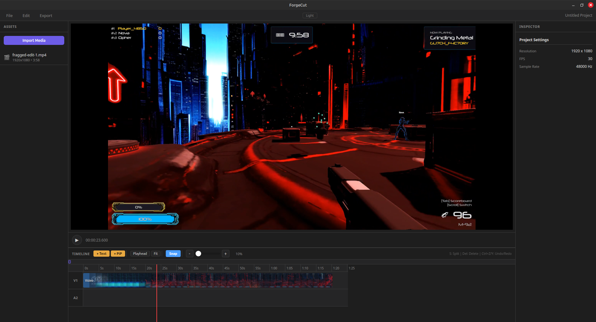

# ForgeCut

A lightweight, Linux-first timeline video editor built with Rust and Tauri. Trim, stitch, add overlays, and export — fast.



## Features

- **Timeline editing** — Multi-track video and audio timeline with drag, trim, split, and move
- **Real-time preview** — Embedded mpv player with frame-accurate scrubbing
- **Asset bin** — Import video, audio, and image assets; drag directly onto the timeline
- **Thumbnails & waveforms** — Visual clip previews and audio waveform rendering
- **Text & image overlays** — Add titles and image overlays at any position
- **PiP (Picture-in-Picture)** — Multiple video tracks with independent positioning
- **Export** — Hardware-accelerated ffmpeg export with live progress bar
- **Undo / Redo** — Full history for all timeline edits (Ctrl+Z / Ctrl+Shift+Z)
- **Snapping** — Magnetic clip edges for precise alignment
- **Project save / load** — Save and reopen projects in `.forgecut` format
- **Dark & light themes** — Toggle at any time; preference persisted

## Architecture

ForgeCut is a [Tauri 2](https://tauri.app) application — a Rust backend exposed to a React frontend via typed IPC commands.

```
forgecut/
├── crates/
│   ├── forgecut_core      # Data model, timeline editing, undo/redo, save/load
│   ├── forgecut_render    # ffmpeg integration: probe, filter graph, export
│   └── forgecut_preview   # mpv IPC: embedded playback, seek, frame sync
└── apps/
    └── forgecut_gui/
        ├── src-tauri/     # Tauri 2 backend — commands, app state
        └── ui/            # React + Vite frontend
```

## Prerequisites

**Runtime dependencies (Linux):**

```bash
# Ubuntu / Debian
sudo apt-get install mpv ffmpeg

# Fedora
sudo dnf install mpv ffmpeg
```

**Build dependencies:**

```bash
sudo apt-get install \
  libwebkit2gtk-4.1-dev libgtk-3-dev \
  libayatana-appindicator3-dev librsvg2-dev \
  libx11-dev libxext-dev patchelf
```

- [Rust](https://rustup.rs) (stable)
- [Node.js](https://nodejs.org) ≥ 20 + Yarn (`corepack enable`)

## Building

```bash
# Install frontend dependencies
yarn --cwd apps/forgecut_gui/ui install

# Development (hot reload)
cargo tauri dev --manifest-path apps/forgecut_gui/src-tauri/Cargo.toml

# Production build
cargo tauri build --manifest-path apps/forgecut_gui/src-tauri/Cargo.toml
```

## Running Tests

```bash
# Rust unit tests (107 tests)
cargo test --workspace

# Frontend tests (39 tests)
yarn --cwd apps/forgecut_gui/ui test
```

## Keyboard Shortcuts

| Shortcut | Action |
|---|---|
| `Space` | Play / pause |
| `S` | Split clip at playhead |
| `Delete` / `Backspace` | Delete selected clip |
| `Ctrl+Z` | Undo |
| `Ctrl+Shift+Z` | Redo |
| `Ctrl+=` / `Ctrl+-` | Zoom timeline in / out |
| `Ctrl+0` | Fit timeline to window |
| Drag clip edge | Trim in / out point |
| Drag clip | Move (snaps to other clip edges) |

## CI

GitHub Actions runs on every push and pull request:

| Job | Linux | macOS | Windows |
|---|---|---|---|
| Rust tests | Full workspace | Core + Render | Core + Render |
| Frontend tests | Yes | Yes | Yes |
| Tauri build | Yes | — | — |

> macOS and Windows run the portable crates only. `forgecut_preview` uses X11/mpv which is Linux-specific.

## License

MIT — see [Cargo.toml](Cargo.toml)
