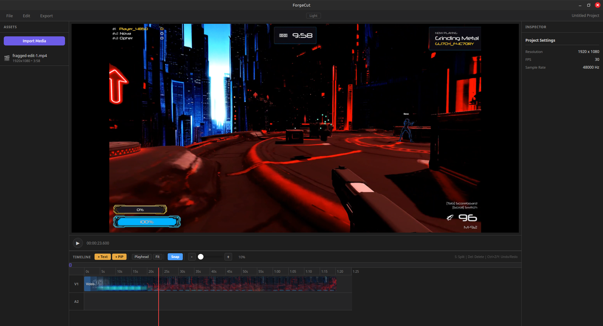

# ForgeCut

A lightweight, Linux-first timeline video editor built with Electron and React. Trim, stitch, add overlays, and export fast.



## Features

- **Timeline editing** — Multi-track video and audio timeline with drag, trim, split, and move
- **Real-time preview** — HTML5 video preview with frame-accurate scrubbing
- **Asset bin** — Import video, audio, and image assets; drag directly onto the timeline
- **Thumbnails & waveforms** — Visual clip previews and audio waveform rendering
- **Text & image overlays** — Add titles and image overlays at any position
- **PiP (Picture-in-Picture)** — Multiple video tracks with independent positioning
- **Export** — Hardware-accelerated ffmpeg export with live progress bar
- **Undo / Redo** — Full history for all timeline edits (Ctrl+Z / Ctrl+Shift+Z)
- **Snapping** — Magnetic clip edges for precise alignment
- **Project save / load** — Save and reopen projects in `.forgecut` format
- **Dark & light themes** — Toggle at any time; preference persisted

## Architecture

ForgeCut is a pure Electron/TypeScript application: a React/Vite renderer talks to a Node backend in the Electron main process over a typed IPC bridge.

```
apps/forgecut_gui/ui/
├── electron/
│   ├── main.ts               # App entry: window, IPC wiring, media protocol
│   ├── preload.cts           # contextBridge exposing window.forgecut
│   ├── shared/
│   │   └── ipc-contract.ts   # Single source of truth: domain types + CommandMap
│   └── backend/
│       ├── ipc.ts            # Command dispatch (checked against the contract)
│       ├── commands/         # IPC command handlers by domain
│       ├── state.ts          # Project state + snapshot-based undo/redo
│       ├── timeline-ops.ts   # Pure timeline mutations
│       ├── exporter.ts       # ffmpeg filter-graph compiler + runner
│       ├── media-probe.ts    # ffprobe asset import
│       ├── media-derived.ts  # Thumbnails and waveforms
│       └── media-protocol.ts # Range-aware forgecut-media:// serving
└── src/
    ├── components/           # Thin views (Timeline, TimelineClip, Preview, ...)
    ├── hooks/                # Behavior: interactions, shortcuts, media, playback
    └── lib/
        ├── bridge.ts         # Typed invoke()/listen() over window.forgecut
        ├── timeline/         # Pure geometry and item math
        └── preview/          # Playback time utils and video element helpers
```

Key design points:

- **Typed IPC contract** — `electron/shared/ipc-contract.ts` declares every command's args and result. The backend dispatch table fails to compile if a command lacks a handler; the renderer's `invoke()` type-checks command names, args, and results.
- **Range-aware media serving** — the `forgecut-media://` protocol answers HTTP Range requests with 206 responses so the HTML5 preview can seek and scrub frame-accurately.
- **Snapshot undo/redo** — every timeline edit captures before/after snapshots server-side; undo/redo is a stack swap.
- **ffmpeg/ffprobe as child processes** — never linked, always spawned; export compiles the timeline into a single ffmpeg filter graph.
- **Scrubbing lives on the ruler** — clicking a clip selects it; only the ruler moves the playhead.

## Prerequisites

**Runtime dependencies (Linux):**

```bash
# Ubuntu / Debian
sudo apt-get install ffmpeg

# Fedora
sudo dnf install ffmpeg
```

**Build dependencies:**

- [Node.js](https://nodejs.org) ≥ 20 + Yarn (`corepack enable`)

## Building

```bash
# Install frontend dependencies
yarn --cwd apps/forgecut_gui/ui install

# Development (hot reload)
yarn --cwd apps/forgecut_gui/ui dev

# Production build
yarn --cwd apps/forgecut_gui/ui build
```

## Running Tests

```bash
# Frontend and Electron backend tests
yarn --cwd apps/forgecut_gui/ui test
```

## Keyboard Shortcuts

| Shortcut | Action |
|---|---|
| `Space` | Play / pause |
| `S` | Split clip at playhead |
| `Delete` / `Backspace` | Delete selected clip |
| `Ctrl+Z` | Undo |
| `Ctrl+Shift+Z` | Redo |
| `Ctrl+=` / `Ctrl+-` | Zoom timeline in / out |
| `Ctrl+0` | Fit timeline to window |
| Drag clip edge | Trim in / out point |
| Drag clip | Move (snaps to other clip edges) |

## CI

GitHub Actions runs on every push and pull request:

| Job | Linux | macOS | Windows |
|---|---|---|---|
| Frontend tests | Yes | Yes | Yes |
| Electron build + startup check | Yes | No | No |

## License

MIT — see [LICENSE](apps/forgecut_gui/ui/LICENSE)
